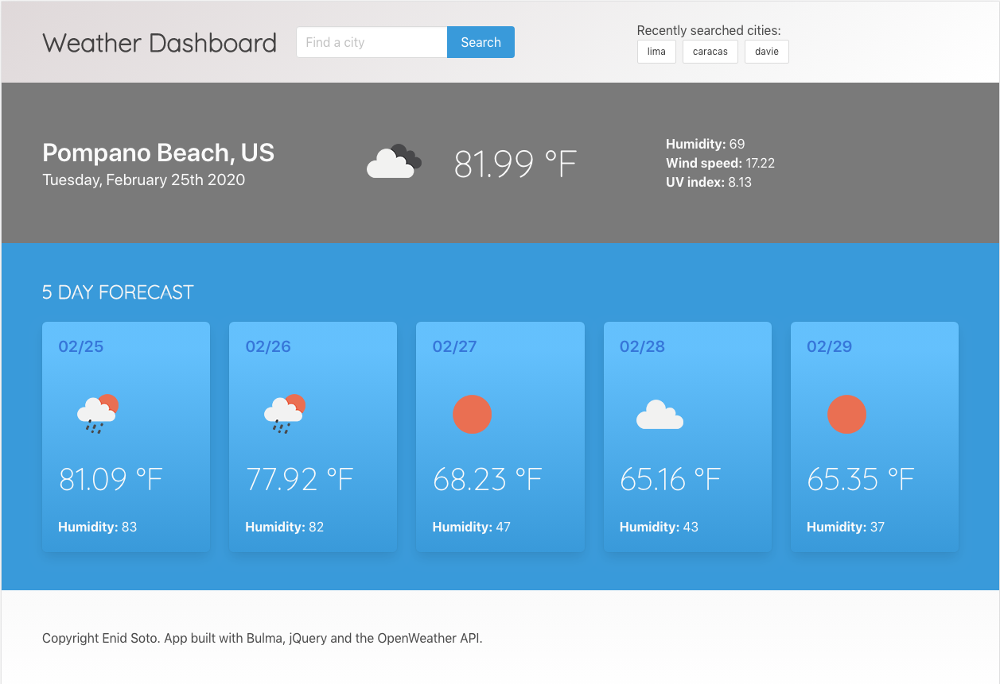

# Weather Dashboard

***Author: Enid Soto***

This simple application allows the user to get the current weather and a 5 day weather forecast for their current location or a location of their choice. 

## Purpose

The purpose of this project is to get familiar with APIs. It was an assignment of the UM Full Stack Developer Bootcamp 2019-2020.

## Technologies used

The application's interface was built with *Bulma* and very minimum custom css styles. The functionality was implemented with jQuery and Moment.js. The weather data was retrieved from the "OpenWeather API" and "freegeoip.app."

## Functionality

1. In the header, the user can find an input box to perform a search.
2. On first visit, the application will get the user's location via geolocation. The page will display all the weather information for that location.
3. When the user types in a search, the location will be added to the header as a button. Each new search will add another button to the "Recently searched cities" button group. The user can click any of the buttons, and the weather information on the page will update to match the button.
4. If the user reloads the page, the "Recently searched cities" button group will show.

## User interface

## Link to the deployed application

You can find the deployed application [here](https://enma1009.github.io/weather-dashboard/)